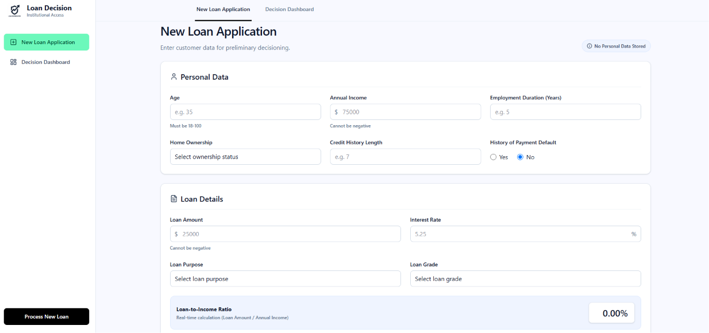
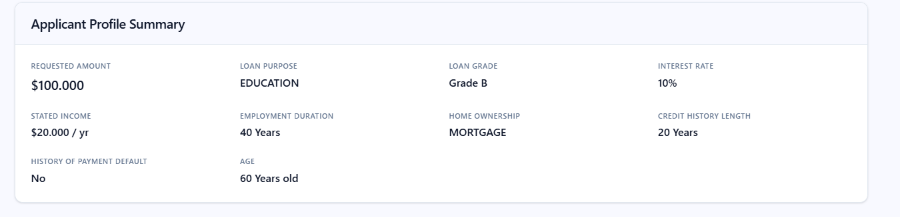
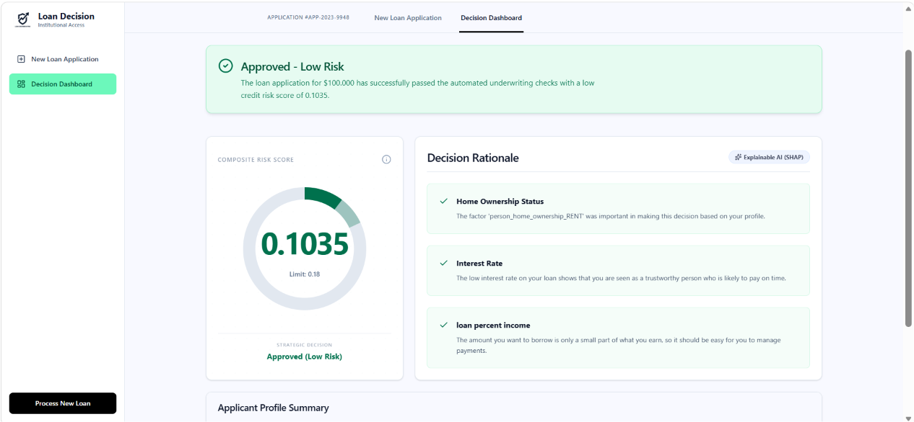
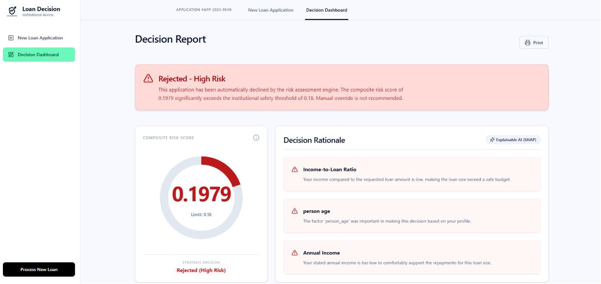
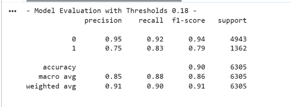
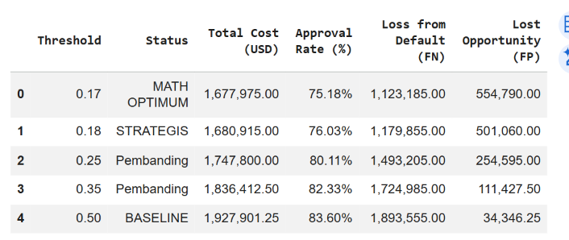
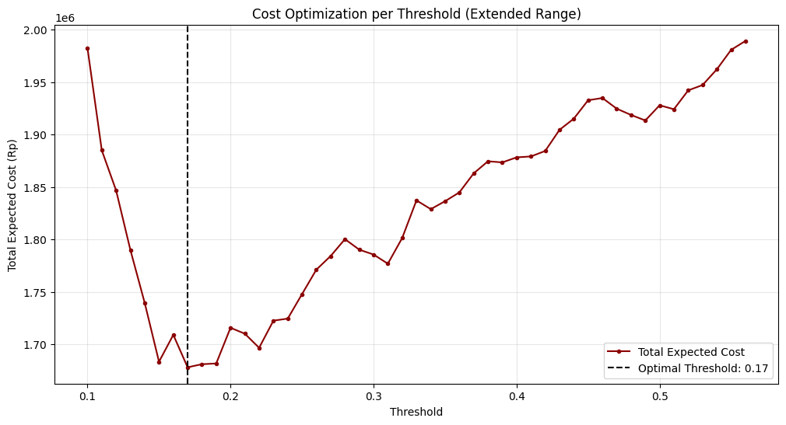

# Credit Risk Prediction & Financial Cost Optimization

## Overview

This project presents an end-to-end machine learning solution for **credit default risk prediction** with a strong emphasis on **financial decision optimization**. Rather than focusing solely on predictive accuracy, the system incorporates a cost-sensitive framework that minimizes real-world economic losses by optimizing the loan approval threshold according to business objectives.

The solution combines predictive modeling, financial cost analysis, and explainable AI (XAI) to support transparent and economically informed lending decisions.

---

## Key Features

### Credit Risk Prediction

- Predicts the probability of borrower default using a calibrated XGBoost classifier.
- Produces reliable probability estimates for risk-based decision making.

### Financial Cost Optimization

- Determines the optimal approval threshold based on business costs instead of accuracy alone.
- Minimizes expected financial losses by balancing:
  - **Loss Given Default (LGD)** for risky borrowers.
  - **Opportunity Cost** from rejecting creditworthy applicants.

### Explainable AI (SHAP)

- Generates transparent explanations for every prediction.
- Identifies the key factors influencing approval or rejection decisions.
- Provides human-readable decision rationales for end users.

### Data Quality & Reliability

- Automated handling of missing values and outliers.
- Stratified cross-validation for model stability assessment.
- Probability calibration to improve prediction reliability.

---

## Technology Stack

| Category                | Tools                 |
| ----------------------- | --------------------- |
| Programming Language    | Python                |
| Machine Learning        | Scikit-Learn, XGBoost |
| Data Processing         | Pandas, NumPy         |
| Visualization           | Matplotlib, Seaborn   |
| Explainable AI          | SHAP                  |
| Model Serialization     | Joblib                |
| Development Environment | Google Colab          |

---

## Setup and Installation

### Backend (Python/FastAPI)

1.  **Navigate to the backend directory:**

    ```bash
    cd backend
    ```

2.  **Create a virtual environment:**

    ```bash
    python -m venv .venv
    ```

3.  **Activate the virtual environment:**
    - **Windows:**
      ```bash
      .venv\Scripts\activate
      ```
    - **macOS/Linux:**
      ```bash
      source .venv/bin/activate
      ```

4.  **Install dependencies:**

    ```bash
    pip install -r requirements.txt
    ```

5.  **Run the FastAPI server:**
    ```bash
    uvicorn app.main:app --reload
    ```
    The server will be running at `http://127.0.0.1:8000`.

### Frontend (React)

1.  **Navigate to the frontend directory:**

    ```bash
    cd frontend
    ```

2.  **Install dependencies:**

    ```bash
    npm install
    ```

3.  **Run the development server:**
    ```bash
    npm run dev
    ```
    The application will be accessible at `http://localhost:5173`.

---

## Project Workflow

```text
Raw Applicant Data
        │
        ▼
Data Cleaning & Preprocessing
        │
        ▼
Feature Engineering
        │
        ▼
XGBoost Training
        │
        ▼
Probability Calibration
        │
        ▼
Cost-Based Threshold Optimization
        │
        ▼
SHAP Explainability Layer
        │
        ▼
Final Loan Decision
```

---

## Model Outputs

The system produces:

- Default probability score.
- Risk classification.
- Loan approval recommendation.
- Financial cost assessment.
- SHAP-based explanation of decision factors.

Example:

```json
{
  "default_probability": 0.23,
  "risk_level": "High Risk",
  "decision": "Rejected",
  "top_factors": [
    "Income-to-Loan Ratio",
    "Credit History Length",
    "Interest Rate"
  ]
}
```

---

## Application Interface

### 1. Loan Application Form



### 2. Applicant Profile Summary



### 3. Loan Approval Result (Accepted)



### 4. Loan Approval Result (Rejected)



---

## Results Summary

### Strategic Threshold

After cost-sensitive optimization and cross-validation analysis, a threshold of **0.18** was selected for deployment.

### Economic Impact

Compared to the conventional threshold of **0.50**, the optimized threshold substantially reduces expected financial losses while maintaining strong approval performance.

### Stability Analysis

A 5-Fold Cross-Validation threshold audit demonstrated that optimal thresholds consistently fall within the range:

```text
0.17 – 0.21
```

This indicates that the selected threshold remains robust across different data partitions.

---

## Model Performance with Threshold 0.18



## Why Was Threshold 0.18 Selected?




Although the mathematically optimal threshold was approximately **0.17**, a deployment threshold of **0.18** was chosen based on business and operational considerations. If the standard threshold of 0.50 is used, the number of False Negatives will increase because more high-risk customers will pass the credit approval process.
Therefore, a strategic threshold of 0.18 was selected based on the optimization of financial costs to mitigate the risk of losses from bad debt (Loss Given Default), even though this results in a higher number of rejected customers (False Positives).

### 1. Business Growth vs. Risk Management

The 0.18 threshold maintains a higher approval rate while remaining extremely close to the minimum-cost solution.

Benefits:

- Increased loan approvals.
- Greater market reach.
- Minimal additional financial risk.

### 2. Cross-Validation Stability


Threshold optimization across five validation folds showed consistent results:

| Fold | Optimal Threshold |
| ---- | ----------------- |
| 1    | 0.19              |
| 2    | 0.17              |
| 3    | 0.19              |
| 4    | 0.18              |
| 5    | 0.21              |

The average threshold is approximately:

```text
0.188
```

making **0.18** a practical and stable deployment choice.

### 3. Financial Trade-Off Optimization

The threshold balances two competing objectives:

#### Default Loss (False Negatives)

A risky borrower is approved and later defaults.

```text
Cost = Loan Amount × 60%
```

#### Opportunity Cost (False Positives)

A safe borrower is incorrectly rejected.

```text
Cost = Loan Amount × 15%
```

This creates a balanced lending strategy that protects profitability while supporting portfolio growth.

---

## Financial Cost Optimization Framework



Traditional classification models optimize metrics such as:

- Accuracy
- Precision
- Recall
- F1-Score
- ROC-AUC

However, financial institutions are primarily concerned with **economic outcomes**.

This project therefore implements a **Cost-Sensitive Decision Framework** that minimizes expected monetary loss.

### Cost Components

#### False Negative (FN)

The model approves a borrower who eventually defaults.

```text
Cost(FN) = Loan Amount × 0.60
```

Where:

- 60% = Loss Given Default (LGD)

#### False Positive (FP)

The model rejects a borrower who would have repaid successfully.

```text
Cost(FP) = Loan Amount × 0.15
```

Where:

- 15% = Estimated Interest Margin / Opportunity Cost

### Total Cost Function

```text
Total Cost =
Σ(False Negatives × LGD Cost)
+
Σ(False Positives × Opportunity Cost)
```

The optimal threshold is selected by minimizing this total expected cost.

---

## Explainable AI with SHAP

To improve transparency and trust, the project integrates SHAP (SHapley Additive exPlanations).

SHAP explanations allow stakeholders to understand:

- Why a loan was approved or rejected.
- Which features most influenced the prediction.
- Whether each feature increased or decreased risk.

Example decision rationale:

- Income-to-Loan Ratio → Increased risk.
- Credit History Length → Reduced risk.
- Interest Rate → Increased risk.
- Previous Default History → Strongly increased risk.

This approach supports responsible AI practices and enhances model interpretability for business users.

---

## Deployment Assets

The notebook exports the following production-ready files:

```text
models/
├── credit_risk_model.pkl
├── trained_preprocessor.joblib
├── model_config.json

```

These assets can be loaded directly into a backend service for real-time inference.

---

## Future Improvements

- Real-time API deployment with FastAPI.
- Interactive dashboard for credit officers.
- Automated model monitoring and drift detection.
- Scenario-based loan simulation.
- Fairness and bias auditing.
- Alternative explainability methods beyond SHAP.

---

## Author

Developed as a practical machine learning project focused on:

- Credit Risk Analytics
- Explainable AI (XAI)
- Financial Decision Optimization
- Cost-Sensitive Machine Learning
